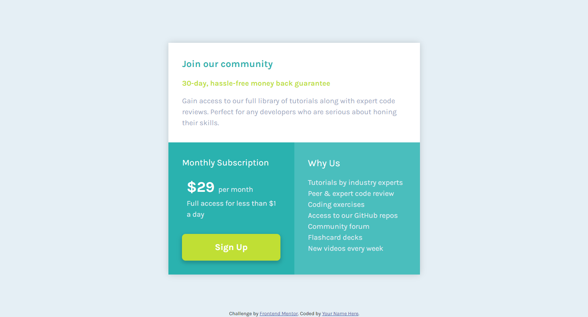

## Table of contents

- [Overview](#overview)
  - [The challenge](#the-challenge)
  - [Screenshot](#screenshot)
  - [Links](#links)
- [My process](#my-process)
  - [Built with](#built-with)
  - [What I learned](#what-i-learned)
  - [Continued development](#continued-development)
  - [Useful resources](#useful-resources)
- [Author](#author)
- [Acknowledgments](#acknowledgments)

## Overview

### The challenge

Users should be able to:

- View the optimal layout depending on their device's screen size
- See hover and focus states for interactive elements

### Screenshot

### Links

- Solution URL: [Add solution URL here](https://github.com/Ashxarya/single-price-grid-component-master)
- Live Site URL: [Add live site URL here](https://grid-component-ashxarya.netlify.app/)

## My process

I started mobile first and then worked my way up to desktop version.

### Built with

- Semantic HTML5 markup
- CSS custom properties
- Flexbox
- CSS Grid
- Mobile-first workflow

### What I learned

I learnt to work for mobile first.
I used grid more.

### Continued development

Id like to get more into javascript and animations at a latter point.

### Useful resources

- [Kevin Powell taCkling this challenge](https://www.youtube.com/watch?v=B2WL6KkqhLQ) - This helped me learn SO much about HTML structuring and how to write CSS cleaner.

## Author

- Website - [Navendu](https://github.com/Ashxarya?tab=repositories)
- Frontend Mentor - [@Ashxarya](https://www.frontendmentor.io/profile/Ashxarya)
